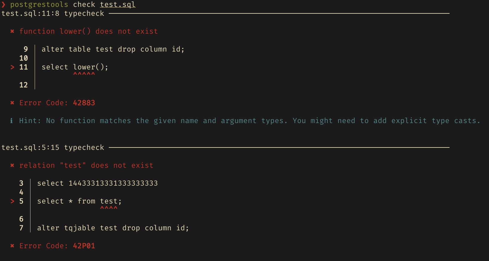

# Postgres Tools

A collection of language tools and a Language Server Protocol (LSP) implementation for Postgres, focusing on developer experience and reliable SQL tooling.

---

**Source Code**: <a href="https://github.com/supabase-community/postgres-language-server" target="_blank">https://github.com/supabase-community/postgres-language-server</a>

---

## Overview

This project provides a toolchain for Postgres development

##### Postgres Language Server


##### CLI Demo



The toolchain is built on Postgres' own parser `libpg_query` to ensure 100% syntax compatibility. It uses a Server-Client architecture and is a transport-agnostic. This means all features can be accessed through the [Language Server Protocol](https://microsoft.github.io/language-server-protocol/) as well as various interfaces like a CLI, HTTP APIs, or a WebAssembly module.

The following features are implemented:

- Autocompletion
- Syntax Error Highlighting
- Type-checking (via `EXPLAIN` error insights)
- Linter, inspired by [Squawk](https://squawkhq.com)

We are currently focused on refining and enhancing these core features. For future plans and opportunities to contribute, please check out the issues and discussions. Any contributions are welcome!

## Installation

There are various ways to use the toolchain.

### CLI

Grab the executable for your platform from the [latest CLI release](https://github.com/supabase-community/postgres-language-server/releases/latest) on GitHub and give it execution permission:

```sh
curl -L https://github.com/supabase-community/postgres-language-server/releases/download/<version>/postgrestools_aarch64-apple-darwin -o postgrestools
chmod +x postgrestools
```

Now you can use Postgres Tools by simply running `./postgrestools`.

### NPM

If you are using Node, you can install the CLI via NPM. Run the following commands in a directory containing a `package.json` file.

```sh
npm add --save-dev --save-exact @postgrestools/postgrestools
```

### VSCode

The language server is available on the [VSCode Marketplace](https://marketplace.visualstudio.com/items?itemName=Supabase.postgrestools-vscode). Its published from [this repo](https://github.com/supabase-community/postgrestools-vscode).

### Neovim

You will have to install `nvim-lspconfig`, and follow the [instructions](https://github.com/neovim/nvim-lspconfig/blob/master/doc/configs.md#postgres_lsp).

### GitHub Actions

To use the CLI in GitHub Actions, you can install it via our [GitHub Action](https://github.com/supabase-community/postgrestools-cli-action).

## Configuration

We recommend creating a `postgrestools.jsonc` configuration file for each project. This eliminates repetitive CLI options and ensures that consitent configuration in your editor. Some options are only available from a configuration file. This step is optional: if you are happy with the defaults, you don’t need a configuration file. To create the `postgrestools.jsonc` file, run the `init` command in the root folder of your project:

```sh
postgrestools init
```

You’ll now have a `postgrestools.jsonc` file in your directory:

[//]: # "BEGIN DEFAULT_CONFIGURATION"

```json
{
  "$schema": "https://pgtools.dev/schemas/0.0.0/schema.json",
  "vcs": {
    "enabled": false,
    "clientKind": "git",
    "useIgnoreFile": false
  },
  "files": {
    "ignore": []
  },
  "linter": {
    "enabled": true,
    "rules": {
      "recommended": true
    }
  },
  "db": {
    "host": "127.0.0.1",
    "port": 5432,
    "username": "postgres",
    "password": "postgres",
    "database": "postgres",
    "connTimeoutSecs": 10,
    "allowStatementExecutionsAgainst": ["127.0.0.1/*", "localhost/*"]
  }
}
```

[//]: # "END DEFAULT_CONFIGURATION"

Make sure to edit the database connection settings to connect to your local development database. To see all options, run `postgrestools --help`.

## Usage

You can use Postgres Tools via the command line or a using a code editor that supports an LSP.

#### Using the CLI

The CLI exposes a simple `check` command that will run all checks on the given files or paths.

```sh
postgrestools check myfile.sql
```

Make sure to check out the other options by running `postgrestools --help`. We will provide guides for specific use cases like linting migration files soon.

#### Using the LSP Proxy

Postgres Tools has a command called `lsp-proxy`. When executed, two processes will spawn:

- a daemon that does execute the requested operations;
- a server that functions as a proxy between the requests of the client - the editor - and the server - the daemon;
  If your editor is able to interact with a server and send [JSON-RPC](https://www.jsonrpc.org) requests, you only need to configure the editor to run that command.

#### Using the daemon with the binary

Using the binary via CLI is very efficient, although you won’t be able to provide logs to your users. The CLI allows you to bootstrap a daemon and then use the CLI commands through the daemon itself.
In order to do so, you first need to start a daemon process with the start command:

```sh
postgrestools start
```

Then, every command needs to add the `--use-server` options, e.g.:

```sh
echo "select 1" | biome check --use-server --stdin-file-path=dummy.sql
```

#### Daemon logs

The daemon saves logs in your file system. Logs are stored in a folder called `pgt-logs`. The path of this folder changes based on your operative system:

- Linux: `~/.cache/pgt;`
- Windows: `C:\Users\<UserName>\AppData\Local\supabase-community\pgt\cache`
- macOS: `/Users/<UserName>/Library/Caches/dev.supabase-community.pgt`

For other operative systems, you can find the folder in the system’s temporary directory.

You can change the location of the `pgt-logs` folder via the `PGT_LOG_PATH` variable.
