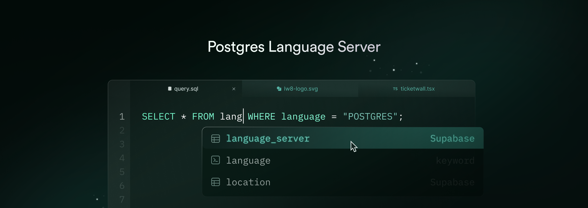

# Postgres Language Server

A collection of language tools and a Language Server Protocol (LSP) implementation for Postgres, focusing on developer experience and reliable SQL tooling.

---

**Source Code**: <a href="https://github.com/supabase-community/postgres_lsp" target="_blank">https://github.com/supabase-community/postgres_lsp</a>

---

## Overview

This project provides a toolchain for Postgres development, built on Postgres' own parser `libpg_query` to ensure 100% syntax compatibility. It is built on a Server-Client architecture with a transport-agnostic design. This means all features can be accessed not only through the [Language Server Protocol](https://microsoft.github.io/language-server-protocol/), but also through other interfaces like a CLI, HTTP APIs, or a WebAssembly module. The goal is to make all the great Postgres tooling out there as accessible as possible, and to build anything that is missing ourselves.

Currently, the following features are implemented:

- Autocompletion
- Syntax Error Highlighting
- Type-checking (via `EXPLAIN` error insights)
- Linter, inspired by [Squawk](https://squawkhq.com)

Our current focus is on refining and enhancing these core features while building a robust and easily accessible infrastructure. For future plans and opportunities to contribute, please check out the issues and discussions. Any contributions are welcome!

## Installation

To install Postgres Tools, grab the executable for your platform from the [latest CLI release](https://github.com/supabase-community/postgres_lsp/releases) on GitHub and give it execution permission.

```sh
curl -L https://github.com/supabase-community/postgres_lsp/releases/download/<version>/postgrestools_aarch64-apple-darwin -o postgrestools
chmod +x postgrestools
```

Now you can use Postgres Tools by simply running `./postgrestools`.

If you are using Node anyways, you can also install the CLI via NPM. Run the following commands in a directory containing a `package.json` file.

```sh
pnpm add --save-dev --save-exact @postgrestools/postgrestools
```

To use Postgres Tools in your favorite IDE, we recommend [installing an editor plugin](#install-an-editor-plugin).

## Configuration

We recommend that you create a `postgrestools.jsonc` configuration file for each project. This eliminates the need to repeat the CLI options each time you run a command, and ensures that we use the same configuration in your editor. Some options are also only available from a configuration file. If you are happy with the defaults, you don’t need to create a configuration file. To create the `postgrestools.jsonc` file, run the `init` command in the root folder of your project:

```sh
postgrestools init
```

After running the `init` command, you’ll have a `postgrestools.jsonc` file in your directory:

[//]: # (BEGIN DEFAULT_CONFIGURATION)

```json
{
  "$schema": "https://pgtools.dev/schemas/0.0.0/schema.json",
  "vcs": {
    "enabled": false,
    "clientKind": "git",
    "useIgnoreFile": false
  },
  "files": {
    "ignore": []
  },
  "linter": {
    "enabled": true,
    "rules": {
      "recommended": true
    }
  },
  "db": {
    "host": "127.0.0.1",
    "port": 5432,
    "username": "postgres",
    "password": "postgres",
    "database": "postgres",
    "connTimeoutSecs": 10
  }
}
```

[//]: # (END DEFAULT_CONFIGURATION)

Make sure to point the database connection settings at your local development database. To see what else can be configured, run `--help`.

## Usage

You can use the language tools either via CLI or a Language Server.

The CLI exposes a simple `check` command that will run all checks on the given files or paths.

```sh
postgrestools check myfile.sql
```

Make sure to check out the other options. We will provide guides for specific use cases like linting migration files soon.

## Install an Editor Plugin

We recommend installing an editor plugin to get the most out of Postgres Language Tools.

### VSCode

TODO

### Neovim

You will have to install `nvim-lspconfig`, and follow the [instructions](https://github.com/neovim/nvim-lspconfig/blob/master/doc/configs.md#postgres_lsp).


### Other

Postgres Tools has LSP first-class support. If your editor does implement LSP, then the integration of Postgres Tools should be seamless.

#### Use the LSP Proxy

Postgres Tools has a command called `lsp-proxy`. When executed, two processes will spawn:
- a daemon that does execute the requested operations;
- a server that functions as a proxy between the requests of the client - the editor - and the server - the daemon;
If your editor is able to interact with a server and send [JSON-RPC](https://www.jsonrpc.org) requests, you only need to configure the editor to run that command.

#### Use the daemon with the binary
Using the binary via CLI is very efficient, although you won’t be able to provide logs to your users. The CLI allows you to bootstrap a daemon and then use the CLI commands through the daemon itself.
If order to do so, you first need to start a daemon process with the start command:

```sh
postgrestools start
```

Then, every command needs to add the `--use-server` options, e.g.:

```sh
echo "select 1" | biome check --use-server --stdin-file-path=dummy.sql
```

#### Daemon logs
The daemon saves logs in your file system. Logs are stored in a folder called `pgt-logs`. The path of this folder changes based on your operative system:

- Linux: `~/.cache/pgt;`
- Windows: `C:\Users\<UserName>\AppData\Local\supabase-community\pgt\cache`
- macOS: `/Users/<UserName>/Library/Caches/dev.supabase-community.pgt`

For other operative systems, you can find the folder in the system’s temporary directory.

## CI Setup

> [!NOTE]
> We will update this section once we have published the binaries.

